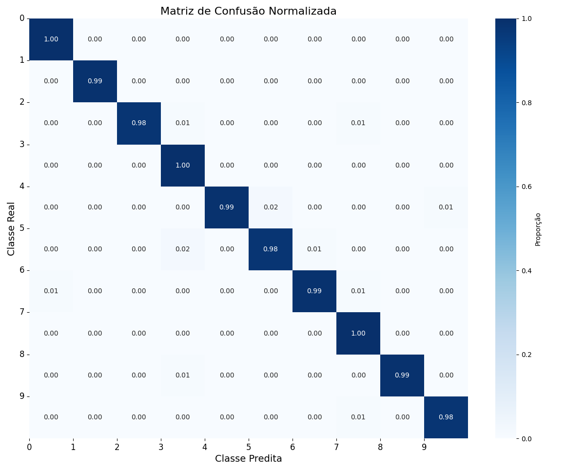
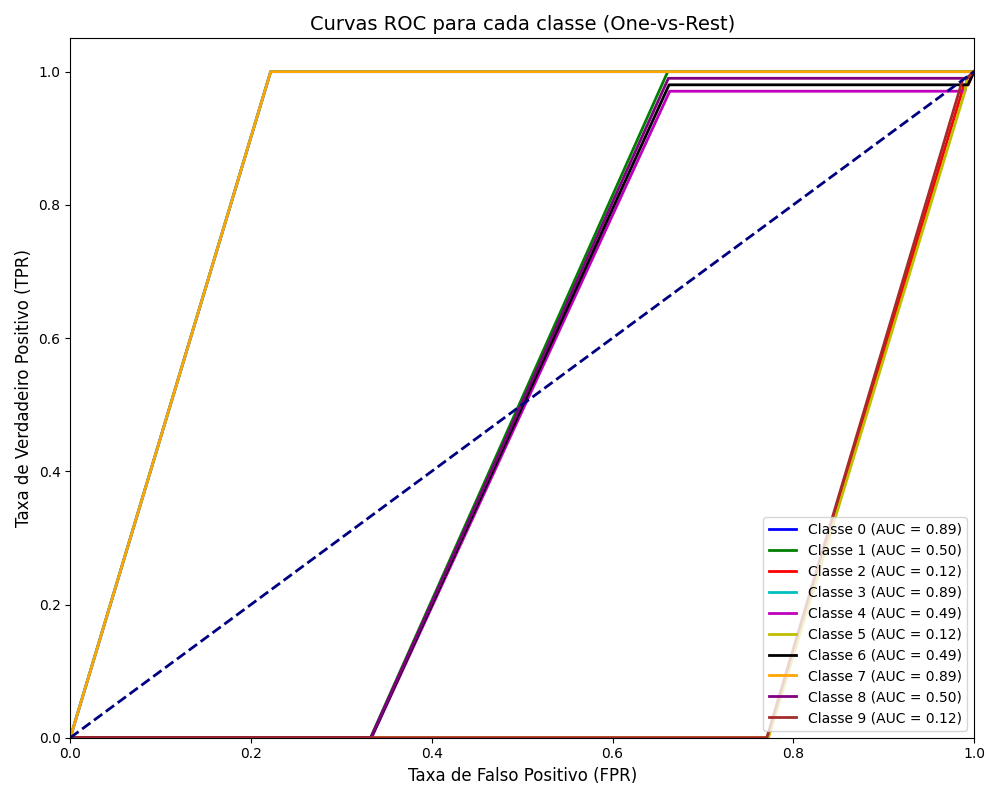

# Cálculo de Métricas de Avaliação de Aprendizado 

   Este projeto calcula as principais métricas para avaliação de modelos de classificação de dados, como acurácia, sensibilidade (recall), especificidade, precisão e F-score, utilizando uma matriz de confusão


[](https://www.python.org/)
[](https://opensource.org/licenses/MIT)
[](https://numpy.org/)
[](https://matplotlib.org/)
[](https://seaborn.pydata.org/)
[](https://scikit-learn.org/)

   
## Descrição da Atividade 

Neste projeto, implementamos cálculos das principais métricas de avaliação para modelos de classificação de dados. Utilizamos uma matriz de confusão 10x10 fornecida como base para os cálculos, representando um problema de classificação multiclasse (provavelmente relacionado a reconhecimento de dígitos). 


## Matriz de Confusão Utilizada 

A matriz de confusão utilizada no projeto é a seguinte: 
 
[[1.00, 0.00, 0.00, 0.00, 0.00, 0.00, 0.00, 0.00, 0.00, 0.00],
 [0.00, 0.99, 0.00, 0.00, 0.00, 0.00, 0.00, 0.00, 0.00, 0.00],
 [0.00, 0.00, 0.98, 0.01, 0.00, 0.00, 0.00, 0.01, 0.00, 0.00],
 [0.00, 0.00, 0.00, 1.00, 0.00, 0.00, 0.00, 0.00, 0.00, 0.00],
 [0.00, 0.00, 0.00, 0.00, 0.99, 0.02, 0.00, 0.00, 0.00, 0.01],
 [0.00, 0.00, 0.00, 0.02, 0.00, 0.98, 0.01, 0.00, 0.00, 0.00],
 [0.01, 0.00, 0.00, 0.00, 0.00, 0.00, 0.99, 0.01, 0.00, 0.00],
 [0.00, 0.00, 0.00, 0.00, 0.00, 0.00, 0.00, 1.00, 0.00, 0.00],
 [0.00, 0.00, 0.00, 0.01, 0.00, 0.00, 0.00, 0.00, 0.99, 0.00],
 [0.00, 0.00, 0.00, 0.00, 0.00, 0.00, 0.00, 0.01, 0.00, 0.98]]
 
 
## Métricas Calculadas 
### Métricas Globais 

    Acurácia: 0.9860
    Precisão (weighted): 0.9860
    Sensibilidade/Recall (weighted): 0.9860
    F1-Score (weighted): 0.9860
     

### Métricas por Classe 

| Classe | Precisão | Recall | F1-SCORE |
|--------|----------|--------|----------|
| 0      | 0.9901   | 1.0000 | 0.9950   |
| 1      | 1.0000   | 0.9900 | 0.9950   |
| 2      | 0.9800   | 0.9800 | 0.9800   |
| 3      | 0.9804   | 1.0000 | 0.9901   |
| 4      | 0.9900   | 0.9800 | 0.9850   |
| 5      | 0.9800   | 0.9800 | 0.9800   |
| 6      | 0.9900   | 0.9900 | 0.9900   |
| 7      | 1.0000   | 1.0000 | 1.0000   |
| 8      | 0.9900   | 0.9900 | 0.9900   |
| 9      | 0.9800   | 0.9800 | 0.9800   |

## Visualizações 

### Matriz de Confusão 



### Curvas ROC 



   
## Pré-requisitos 

    Python 3.7+
    Ambiente virtual (recomendado)
     

## Instalação 

### Clone o repositório:
     
```bash
git clone https://github.com/seu-usuario/Metricas_De_Avalicao.git
cd Metricas_De_Avalicao
```
 

### Crie e ative um ambiente virtual:
     
```bash
python -m venv venv
source venv/bin/activate  # Linux/Mac
venv\Scripts\activate     # Windows
```
 
### Instale as dependências:
     
```bash
pip install -r requirements.txt
``` 
 
## Como Executar 

### Execute o código com o comando: 

```bash
python Calculo_De_Metricas.py
``` 

## O programa irá: 

    Calcular as métricas de avaliação com base na matriz de confusão fornecida
    Exibir os resultados no terminal
    Gerar e exibir gráficos da matriz de confusão e das curvas ROC
     
## Requisitos 

O arquivo requirements.txt contém todas as dependências necessárias: 

    numpy
    matplotlib
    seaborn
    scikit-learn
 
 
## Fórmulas das Métricas 

* **Acurácia**
	
(VP + VN) / (VP + VN + FP + FN)

* **Sensibilidade (Recall)**
	
VP / (VP + FN)

* **Especificidade**
	
VN / (VN + FP)

* **Precisão**
	
VP / (VP + FP)

* **F-score**
	
2 * (Precisão * Recall) / (Precisão + Recall)

 
## Autor 

Nicolas Souza  
[LinkedIn](https://linkedin.com/in/nicolas-y-p-souza) | [GitHub](https://github.com/NicolasYPS)

**Projeto desenvolvido para a disciplina de Avaliação de Metricas para Machine Learned**
**Este projeto demonstra o cálculo de métricas de avaliação com base em uma matriz de confusão fornecida para a atividade** 
     